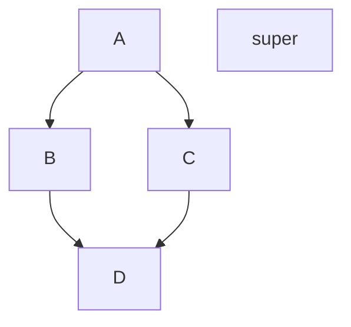

# Mon projet d'analyse MISSIONS-APP

missions-app : gestion des dossiers de missions : wallonnie bruxelles international, service dossier de missions

Faire l'analyse de l'app de gestion de mission, en respecant les differents arrete qui réagie l'envoie d'agent en mission:

https://www.ejustice.just.fgov.be/eli/arrete/2013/12/19/2014200199/moniteur
    (version Wallone)

https://www.ejustice.just.fgov.be/eli/arrete/2013/12/19/2014029106/moniteur
    (version Communauté française)
        (.... les deux sont identiques)

test ligne code mermaid pour diagramme

